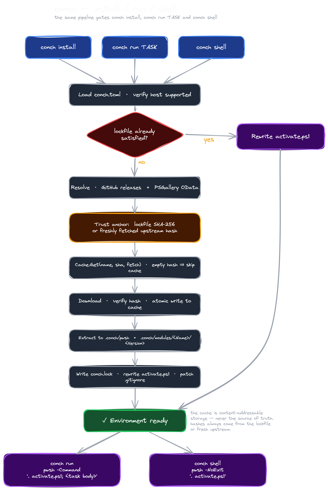

## Documentation
- [Installation](docs/Installation.md) — install conch on Linux or Windows.
- [Usage](docs/Usage.md) — commands, manifest examples, and environment variable overrides.

## Mission
Conch is a declarative, cross-platform PowerShell environment manager. Describe your PowerShell version and modules in a single TOML manifest, run one command, and get a reproducible, isolated environment — pixi-style ergonomics, purpose-built for PowerShell.

Solving the age-old "it works on my computer" problem, one manifest at a time.

## How it works
Every project gets a manifest at its root — `conch.toml` — that names the PowerShell version, the modules, and any tasks the project needs. `conch install` reads that manifest, decides
what (if anything) is missing from the project's local `.conch/` directory, resolves any new versions against GitHub releases (for PowerShell) or the PSGallery v2 OData feed (for
modules), and materialises the result. The same pipeline gates `conch run TASK` and `conch shell` — both auto-install before they hand control over to `pwsh`, so a fresh checkout is one
command away from a working environment.

The integrity story is the part worth understanding. Downloads pass through a per-user content-addressable cache that is **never trusted as the source of truth**: every cache lookup
needs an externally-supplied SHA-256 to compare against. On a fresh install conch fetches the upstream manifest (`hashes.sha256` from the PowerShell release for the binary, the OData
feed for each module's SHA-512) and verifies the downloaded bytes against that. Once verified, the SHA-256 is recorded in `conch.lock` so subsequent installs can use the lockfile as the
trust anchor and short-circuit the upstream lookup entirely. A bumped version in `conch.toml` makes the lockfile spec-mismatch its manifest, which forces a re-resolve; a tampered cache
file fails its hash check and is replaced.

Once the artefacts are in place, `activate.ps1` is regenerated from the manifest's `[powershell]` and `[preferences]` sections — tasks are deliberately *not* baked in, so editing
`[tasks]` takes effect on the next `conch run` without a re-install. The script anchors itself on `$PSScriptRoot` so the whole project directory is portable, isolates `PSModulePath` to
`.conch/modules` plus the bundled engine modules (without which basic cmdlets like `Add-Member` would be unreachable), and tidies up its scratch variables on exit.

